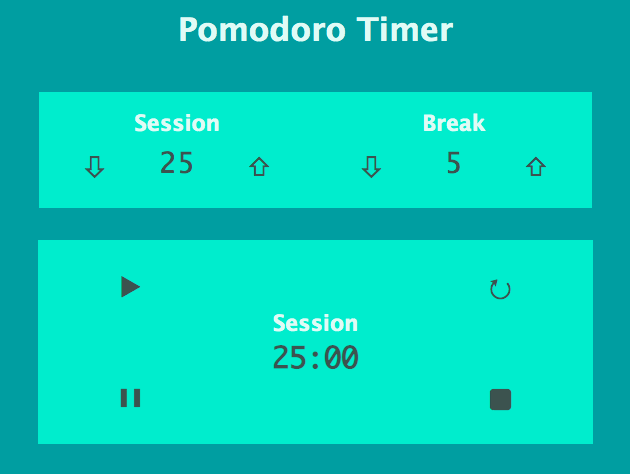

# Pomodoro Timer

## General Information:
This project was complete following The Odin Project's [curriculum](https://www.theodinproject.com/courses/web-development-101/lessons/pairing-project). The purpose was to create a Pomodoro timer using the technologies listed below.

## Screenshot:

## Technologies:
- HTML
- CSS
- Vanilla Javascript

## Setup: 
The live version of the webpage can be seen [here](https://tpsst5.github.io/pomodoro_timer/).
## Status:
This project is complete.